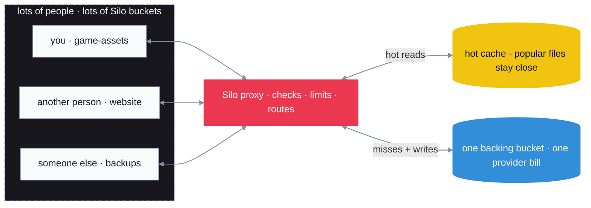

# *SILO*

**Free S3-compatible object storage for Hack Clubbers.**

[go to silo](https://dashboard.silo.deployor.dev) · [read the docs](https://dashboard.silo.deployor.dev/docs) · [meet the dataplane](./dataplane)

> [!NOTE]
> A tiny project should not need a credit card, six tabs of cloud docs, and a quiet fear of the bill at the end of the month.

## Put stuff somewhere

We built Silo because Hack Clubbers needed somewhere good to put files. Not a trial. Not another dashboard to learn. Just a bucket, normal S3 tools, and enough room to make something weird.

Use it for game builds, screenshots, backups, static assets, or that one JSON file your project somehow depends on. Buckets can be public or private; the rest is deliberately unsurprising.

- [x] public or private
- [x] works with tools you already know
- [x] made for real Hack Club projects
- [x] no desire to become a hyperscaler

## One bucket underneath, lots on top

The trick is small: Silo is an S3-shaped proxy in front of one big backing bucket. Hack Clubbers create ordinary buckets; Silo checks each request, applies limits, and routes every file into that bucket's own fenced-off corner.

Hot reads can turn around from the cache without bothering the backing store. Misses and writes keep their fenced-off route into the shared bucket. To each person, it feels like their own patch of S3; to the storage provider, it is one bucket and one bill. That is how one cloud account can quietly become storage for a lot of people.

## Fast, by accident and then on purpose

Once Silo worked, we got a little carried away with making it quick. In our mixed-action benchmarks it reached **10 Gb/s** and finished ahead of every other S3 provider we tested—AWS S3 included.

That number is a snapshot from our test, not a law of physics. Region, object size, concurrency, and a warm cache can all move it.

<strong>Okay, but what is actually in this repo?</strong>

A Bun app looks after the friendly parts: the dashboard, accounts, and buckets. A Rust [dataplane](./dataplane) moves the bytes. The rest is deliberately small.

That is the technical overview on purpose.

## Come poke at it

Silo holds real projects, but it is also a project made by people figuring things out as they go. Issues, tiny fixes, big ideas, and “why on earth does it work like that?” questions are all welcome.

Please be kind—and please do not use production as your test suite.

## The boring important bit

Silo is [MIT licensed](LICENSE). If you find a security problem, please read [SECURITY.md](SECURITY.md) instead of opening a public issue. If you want to help, [CONTRIBUTING.md](CONTRIBUTING.md) is short on purpose.

---

made with love for <a href="https://hackclub.com/">Hack Club</a>

