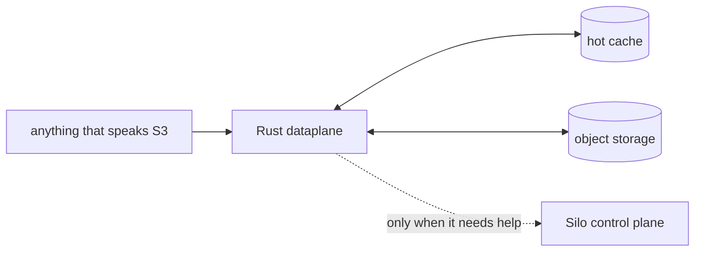

<div align="center">

# The dataplane

**The part of Silo that moves the bytes.**

[← back to Silo](../README.md)

</div>

> [!NOTE]
> This folder has one job: be quick, be careful, and get out of the way.

Every S3 request comes through here. The dataplane checks it, keeps each bucket inside its own fence, caches hot reads, and streams the bytes where they need to go.



Most requests take the straight line through. The dotted line is for the few things that need the rest of Silo.

| The dataplane cares about | It leaves to Bun |
| :--- | :--- |
| signatures, buckets, limits, caches, moving files | logins, pages, and account-shaped things |

## Why Rust?

Because the hot path should be boring: streaming bodies, predictable work, and no unnecessary detours. This is not a manifesto; it was just the right tool.

<details>
<summary><strong>I am here to change it</strong></summary>

From the root of the repo:

```sh
bun run dataplane:check
bun run dataplane:dev
```

The dataplane shares its configuration with the rest of Silo; [the environment example](../.env.production.example) lists what it expects. Running it also needs Postgres, Redis, and backing object storage. Use your own credentials and keep them out of Git.

</details>

That is genuinely most of it.
