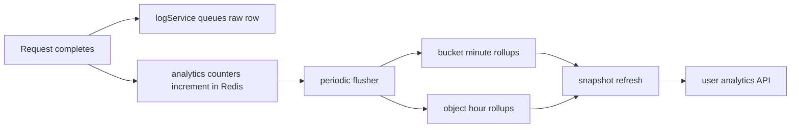

# Bucket analytics plan

## Goals
- Give every user access to a fast, privacy-safe analytics page for their own buckets
- Give admins the same analytics entrypoint from the admin bucket list, with the ability to inspect any bucket
- Make analytics useful for quota debugging, traffic analysis, hot-object discovery, and error diagnosis
- Keep overhead low by separating request-path writes from analytics reads and by using incremental aggregation
- Avoid stalkerish or unsafe data exposure such as raw IP addresses, full requester identifiers for other users, or detailed personal fingerprints

## Privacy and product rules
- Never expose raw [`requestLogs.ipAddress`](src/db/schema.ts:172)
- Never expose raw user agents on user analytics pages
- Show only bucket-owner-safe aggregates such as:
  - request counts
  - status-code families and top error codes
  - ingress and egress totals
  - top objects by hits and egress
  - method mix
  - time-bucketed charts
  - throttling / auth failure counts
  - cache-hit trends if available later
- For shared buckets, collaborators should only see analytics if they already have file read access or a dedicated future analytics permission
- Admins can inspect any bucket but should still see the same privacy-safe presentation by default

## Current reusable inputs
- [`requestLogs`](src/db/schema.ts:153) already stores the raw building blocks we need:
  - bucket linkage
  - bucket name
  - owner and requester IDs
  - method
  - path
  - status code
  - ingress / egress bytes
  - latency
  - created time
- [`logService.logRequest()`](src/services/log-service.ts:27) already batches request inserts, so we have a low-write-overhead event feed
- [`statsService.recordUsage()`](src/services/stats-service.ts:22) already keeps cheap Redis counters for coarse totals
- [`listAdminBuckets()`](src/web/admin/index.ts:334) already computes bucket-level usage summaries for admins
- [`AdminBucketsPage`](src/frontend/routes/AdminBucketsPage.tsx:46) already has an admin bucket table where we can add an analytics entry icon

## Recommended architecture

### 1. Keep raw logs, add rollups
Use a dual-layer model:

1. Raw request events in [`requestLogs`](src/db/schema.ts:153)
2. New rollup tables for fast analytics queries

Recommended new tables:
- `bucket_analytics_minute`
  - bucket id
  - minute timestamp
  - total requests
  - ingress bytes
  - egress bytes
  - avg latency
  - p95 latency approximate
  - 2xx / 3xx / 4xx / 5xx counts
  - auth-related failure counts
  - rate-limit counts
- `bucket_object_analytics_hour`
  - bucket id
  - object key hash or truncated safe key + display key
  - hour timestamp
  - hits
  - egress bytes
  - ingress bytes
  - error count
  - last accessed at
- `bucket_analytics_snapshot`
  - bucket id
  - rolling 1h / 24h / 7d totals
  - hottest objects cache
  - latest spike markers
  - last computed at

Why this shape:
- minute rollups make charts fast
- object-hour rollups make hot-object views fast
- snapshots make default page load nearly instant

### 2. Aggregate asynchronously, not on the request path
Do not compute heavy analytics inside [`logService.logRequest()`](src/services/log-service.ts:27).

Instead:
- keep current batched raw log insert path
- add a lightweight Redis-side increment path for analytics counters keyed by minute and object
- flush those counters periodically into rollup tables, similar to [`statsService.flushToDatabase()`](src/services/stats-service.ts:47)
- optionally backfill recent rollups from raw logs for correctness / recovery

Recommended flow:

### 3. Real-time UX without expensive live queries
Use polling, not websocket first.

Recommended live strategy:
- page load reads snapshot + recent minute series
- client polls a slim delta endpoint every 10 to 20 seconds
- endpoint only returns:
  - latest minute buckets
  - updated totals
  - updated hot-object rows
  - active incidents / spikes

Why polling first:
- much simpler operationally
- easier to cache
- plenty good for bucket analytics
- avoids adding persistent connection overhead

## Safe analytics features to ship

### Overview cards
Per bucket, show:
- total requests in selected window
- egress bytes in selected window
- ingress bytes in selected window
- average latency
- p95 latency
- error rate
- auth / forbidden / rate-limited counts

### Charts
- requests over time
- egress over time
- ingress over time
- error counts over time
- latency over time
- status code stacked bars over time

### Top content insights
- hottest objects by hits
- hottest objects by egress bytes
- objects with the highest error counts
- recent newly hot objects

### Useful diagnostics
- method mix: GET / PUT / DELETE / HEAD
- success vs client error vs server error
- top failing paths / objects
- request bursts and spike markers
- quota burn attribution:
  - top objects by egress contribution
  - top time windows by bandwidth burn

### Admin-only extras on the same page
- admin banner showing they are viewing as admin
- owner identity block
- quick jump from [`AdminBucketsPage`](src/frontend/routes/AdminBucketsPage.tsx:46)
- optional raw-log drilldown link to [`/admin/logs`](src/web/admin/index.ts:1761)

## UX plan

### User-facing page
New page idea:
- `/dashboard/buckets/:bucket/analytics`

Page sections:
1. bucket analytics hero
2. live overview cards
3. time range selector: 1h / 24h / 7d / 30d
4. charts grid
5. hot objects table
6. diagnostics and recent issues
7. optional note explaining privacy-safe analytics

Styling direction:
- reuse the same visual language as [`DashboardPage`](src/frontend/routes/DashboardPage.tsx:153) and [`AdminCachePage`](src/frontend/routes/AdminCachePage.tsx:1)
- dark cards, rounded containers, compact stat pills, mono bucket/object labels
- use warning colors only for genuine issues

### Entry points
- Add a small analytics icon on each bucket row in [`DashboardPage`](src/frontend/routes/DashboardPage.tsx:968)
- Add an analytics icon on each admin bucket row in [`AdminBucketsPage`](src/frontend/routes/AdminBucketsPage.tsx:244)
- Optionally add a mini summary card on bucket detail areas later

## API plan
New endpoints:
- `GET /api/dashboard/buckets/:bucket/analytics/summary`
- `GET /api/dashboard/buckets/:bucket/analytics/timeseries?range=24h`
- `GET /api/dashboard/buckets/:bucket/analytics/objects?sort=hits`
- `GET /api/dashboard/buckets/:bucket/analytics/live?since=...`

Admin mirror:
- `GET /api/admin/buckets/:bucket/analytics/...`
or one shared service with admin bypass

All endpoints should:
- enforce ownership / admin access
- possibly allow collaborators with read access
- return privacy-safe aggregate data only
- prefer rollups / snapshots over raw log scans

## Data model changes
Recommended additions:
- `bucket_analytics_minute`
- `bucket_object_analytics_hour`
- `bucket_analytics_snapshot`
- optional `bucket_analytics_spike_events`

Suggested indexes:
- bucket id + time descending
- bucket id + object key + time descending
- bucket id + hit count / egress for top-object materialization support

## Performance plan
- request path stays cheap:
  - batched raw log insert
  - Redis increment for counters only
- analytics pages read from rollups, not directly from full raw logs
- snapshots cached in Redis for a short TTL
- live endpoint returns deltas only
- heavy recomputations happen in background flushers

## Retention plan
- raw logs: short to medium retention, useful for admin drilldown and recovery
- minute rollups: medium retention
- hourly object rollups: longer retention
- snapshots: regenerated continuously

Recommended default:
- raw logs retain 14 to 30 days
- minute rollups retain 30 to 90 days
- hourly object rollups retain longer for long-term trend summaries

## Rollout phases
1. Add analytics schema and rollup writers
2. Backfill recent rollups from raw logs
3. Ship owner-facing analytics page with summary + charts + hot objects
4. Add admin entrypoints from [`AdminBucketsPage`](src/frontend/routes/AdminBucketsPage.tsx:46)
5. Add live delta polling and spike markers
6. Add advanced diagnostics refinements if needed

## Implementation checklist
- Add rollup tables and indexes
- Add Redis analytics counter strategy and flush worker
- Add analytics query service layer
- Add user analytics API routes
- Add admin analytics route wrappers
- Add React analytics page
- Add dashboard row icon and admin bucket row icon
- Add live polling path and delta merge logic
- Validate privacy constraints and benchmark overhead

## Environment note
This is not in production yet, so we can make larger structural changes without legacy-compatibility constraints. That means we should prefer the cleaner long-term design over incremental patchwork:
- add dedicated analytics tables instead of trying to overfit existing [`requestLogs`](src/db/schema.ts:153)
- add a dedicated analytics page and API family instead of squeezing this into current admin-only surfaces
- introduce proper rollup + snapshot infrastructure immediately rather than temporary direct-log queries

## Recommendation
Build this with rollups plus short-interval polling, not direct raw-log analytics and not websockets first. That gives the best balance of speed, low request overhead, privacy safety, and operational simplicity for Silo, while still taking advantage of the freedom to make bigger pre-production schema and service changes.
